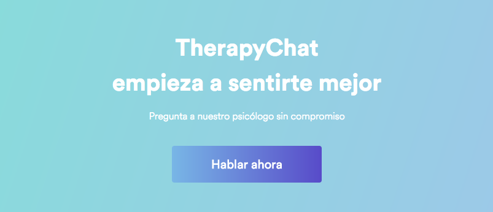

# &lt;therapychat-feeling-better&gt;

`<therapychat-feeling-better>` is call to action component composed by title, subtitle and button.



<!---
```
<custom-element-demo>
  <template>
    <script src="../webcomponentsjs/webcomponents-lite.js"></script>
    <link rel="import" href="therapychat-feeling-better.html">
    <therapychat-feeling-better></therapychat-feeling-better>
  </template>
</custom-element-demo>
```
-->
```html
<therapychat-feeling-better></therapychat-feeling-better>

<!-- default properties -->

<therapychat-feeling-better
  bottom-title="empieza a sentirte mejor"
  button-href="https://app.therapychat.com/signup"
  button-target=""
  button-text="Hablar ahora"
  button-title="Hablar ahora"
  subtitle="Pregunta a nuestro psicólogo sin compromiso"
  top-title="TherapyChat"
></therapychat-feeling-better>
```

## Usage

* All properties are optional
* `button-target` property:
  * Open in new tab: `_blank`
  * Open in same tab: `""` (empty)
